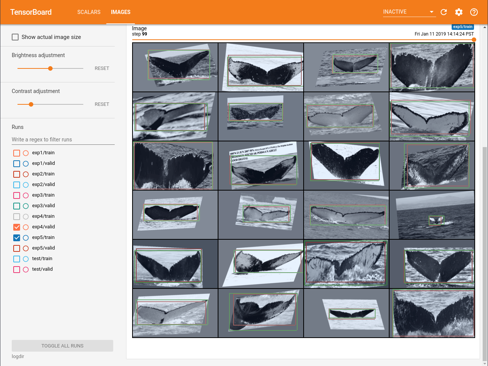
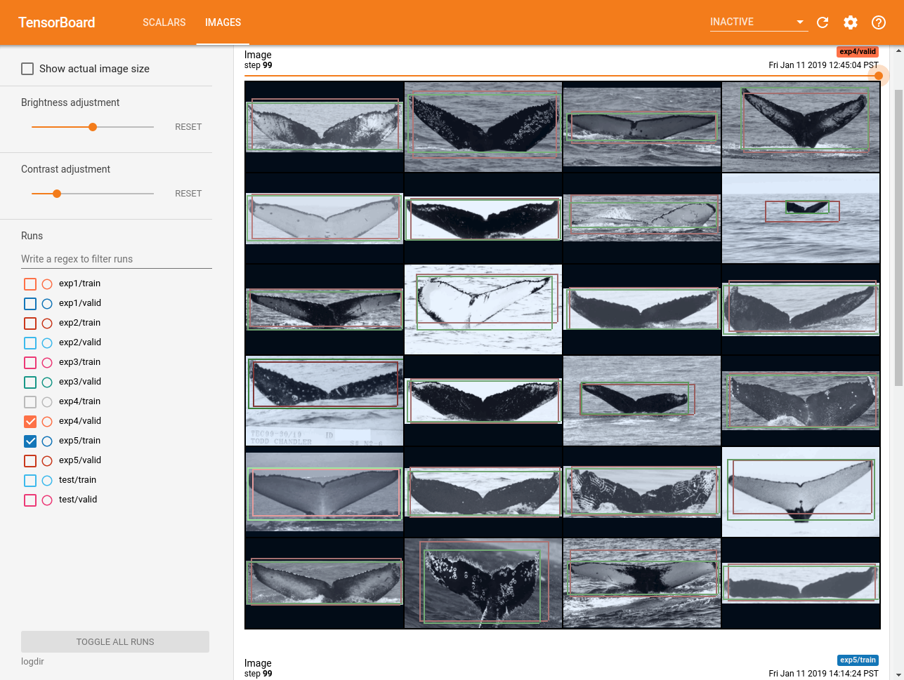
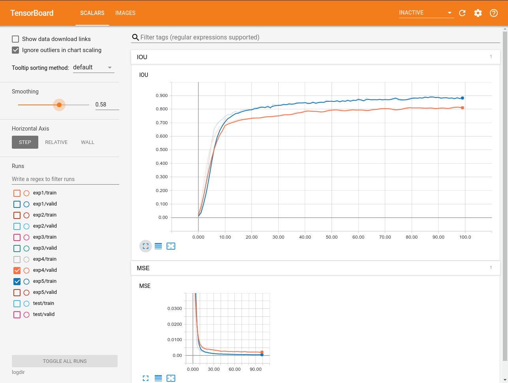

Whale Localization
==================

This is to be used for the Kaggle 
[Humpback Whale Identification Challenge](https://www.kaggle.com/c/humpback-whale-identification),
to put tighter croppings around the whale tails.

With inspiration and data from [https://www.kaggle.com/martinpiotte/bounding-box-model](https://www.kaggle.com/martinpiotte/bounding-box-model)

